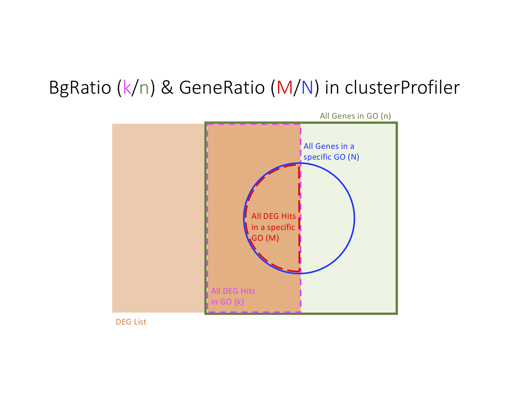

<a name="Top"/>


\newpage


[Top](#Top)

\newpage


# Enrichment Analysis

***

* *[clusterProfiler](https://bioconductor.org/packages/3.8/clusterProfiler)*: statistical analysis and visualization of functional profiles for genes and gene clusters


  
**Figure 1: GeneRatio & BgRatio in clusterProfiler** GeneRatio = $\frac{M}{N}$ & BgRatio = $\frac{k}{n}$

[Top](#Top)


# Session information


<!-- \blandscape -->

```
## R version 3.5.2 (2018-12-20)
## Platform: x86_64-apple-darwin15.6.0 (64-bit)
## Running under: macOS High Sierra 10.13.6
## 
## Matrix products: default
## BLAS: /Library/Frameworks/R.framework/Versions/3.5/Resources/lib/libRblas.0.dylib
## LAPACK: /Library/Frameworks/R.framework/Versions/3.5/Resources/lib/libRlapack.dylib
## 
## locale:
## [1] en_US.UTF-8/en_US.UTF-8/en_US.UTF-8/C/en_US.UTF-8/en_US.UTF-8
## 
## attached base packages:
## [1] grid      stats     graphics  grDevices utils     datasets  methods  
## [8] base     
## 
## other attached packages:
## [1] captioner_2.2.3.9000 dplyr_0.8.0          png_0.1-7           
## [4] kableExtra_0.9.0     knitr_1.21          
## 
## loaded via a namespace (and not attached):
##  [1] Rcpp_1.0.0          pillar_1.3.1        compiler_3.5.2     
##  [4] BiocManager_1.30.4  tools_3.5.2         digest_0.6.18      
##  [7] evaluate_0.13       tibble_2.0.99.9000  viridisLite_0.3.0  
## [10] pkgconfig_2.0.2     rlang_0.3.1         rstudioapi_0.9.0   
## [13] yaml_2.2.0          xfun_0.4            httr_1.4.0         
## [16] stringr_1.4.0       xml2_1.2.0          hms_0.4.2          
## [19] tidyselect_0.2.5    glue_1.3.0          R6_2.3.0           
## [22] rmarkdown_1.11      readr_1.2.1         purrr_0.3.0        
## [25] magrittr_1.5.0.9000 scales_1.0.0        htmltools_0.3.6    
## [28] assertthat_0.2.0    rvest_0.3.2         BiocStyle_2.10.0   
## [31] colorspace_1.4-0    stringi_1.3.1       munsell_0.5.0      
## [34] crayon_1.3.4
```
<!-- \elandscape -->


[Top](#Top)


# Reference  


